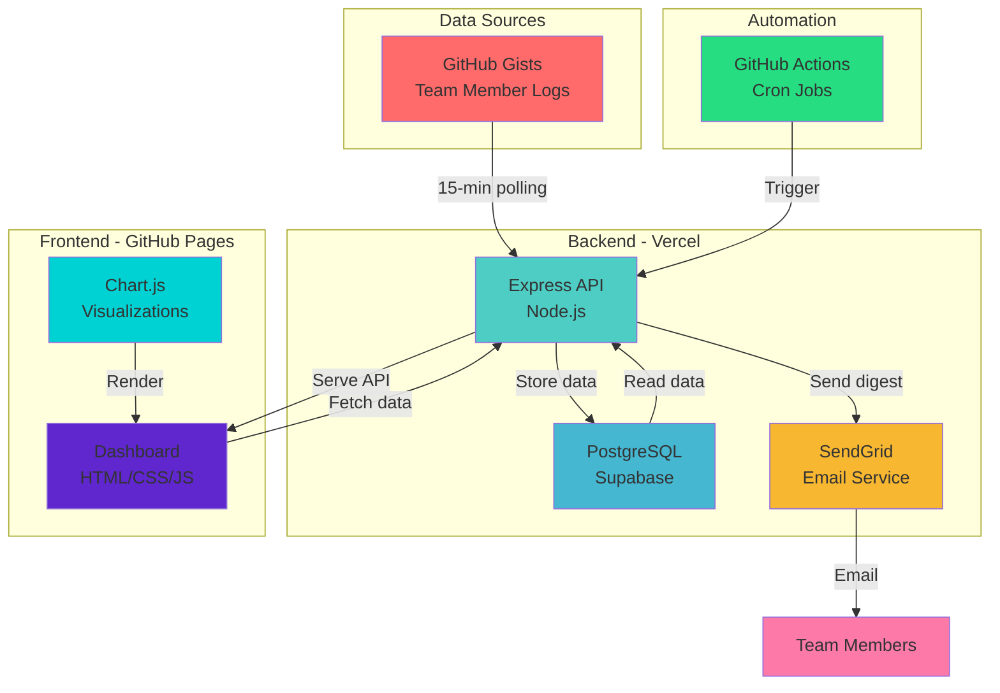

# 🤝 Contributing to Fittober Fitness Tracker

Thank you for your interest in contributing! This document provides guidelines for adding screenshots, visual enhancements, and other improvements to the project.

---

## 📸 Adding Screenshots to README

### What Screenshots to Add

1. **Dashboard Screenshot** (Priority: High)
   - Full view of the main dashboard
   - Shows the doughnut chart with team standings
   - Captures the activity feed
   - Resolution: 1920x1080 or 1440x900

2. **Email Digest Screenshot** (Priority: High)
   - Screenshot of the daily email in an email client
   - Shows today's activities table
   - Shows team standings table
   - Shows embedded chart

3. **Mobile View** (Priority: Medium)
   - Dashboard on mobile device (375x667 for iPhone)
   - Shows responsive design

4. **Activity Feed Detail** (Priority: Low)
   - Close-up of individual activity entries
   - Shows formatting and data structure

### How to Capture Screenshots

#### Option 1: Using macOS Screenshot Tool
```bash
# Full screen screenshot (cmd + shift + 3)
# Selected area (cmd + shift + 4)
# Window screenshot (cmd + shift + 4, then space)

# Save to specific folder
mkdir -p docs/screenshots
# Screenshots will go to ~/Desktop by default, move them:
mv ~/Desktop/Screenshot*.png docs/screenshots/
```

#### Option 2: Using Browser DevTools
1. Open dashboard in Chrome/Firefox
2. Press F12 to open DevTools
3. Toggle device toolbar (cmd + shift + M)
4. Select device (iPhone 12, iPad, Desktop)
5. Right-click → "Capture screenshot" or "Capture full size screenshot"

#### Option 3: Using Online Tools
- [Screely](https://screely.com/) - Add browser frame and background
- [Screenshot.rocks](https://screenshot.rocks/) - Beautiful mockups
- [Shots.so](https://shots.so/) - Animated screenshots

### Optimizing Screenshots

```bash
# Install ImageMagick for optimization
brew install imagemagick

# Resize large screenshots
convert dashboard.png -resize 1200x dashboard_optimized.png

# Reduce file size
convert dashboard.png -quality 85 dashboard_compressed.png

# Add border/shadow for README
convert dashboard.png -bordercolor white -border 10x10 \
  \( +clone -background black -shadow 80x3+5+5 \) \
  +swap -background white -layers merge +repage \
  dashboard_final.png
```

### Adding to README

1. **Create screenshots directory:**
```bash
mkdir -p docs/screenshots
```

2. **Add screenshots to git:**
```bash
git add docs/screenshots/*.png
git commit -m "docs: Add project screenshots"
git push origin main
```

3. **Update README.md:**
```markdown
## 📸 Screenshots

### Dashboard View
<div align="center">
  
  <p><em>Real-time dashboard showing team standings and activity feed</em></p>
</div>

### Daily Email Digest
<div align="center">
  
  <p><em>Automated daily summary sent at 9 PM CST</em></p>
</div>

### Mobile View
<div align="center">
  
  <p><em>Responsive design works on all devices</em></p>
</div>
```

---

## 🎨 Creating Architecture Diagram

### Using Mermaid (Recommended - Already in README)

The README already has an ASCII architecture diagram. To make it visual:

1. **Using Mermaid Live Editor:**
   - Visit [mermaid.live](https://mermaid.live/)
   - Paste this code:



2. **Export as PNG:**
   - Click "Actions" → "PNG"
   - Save as `docs/architecture.png`

3. **Update README:**
```markdown
## 🏗️ Architecture

<div align="center">
  
</div>
```

### Using Draw.io

1. Visit [app.diagrams.net](https://app.diagrams.net/)
2. Create new diagram
3. Use these components:
   - Rectangle for services
   - Arrows for data flow
   - Colors matching our stack
4. Export as PNG
5. Save to `docs/architecture.png`

---

## 🏷️ Adding Badges

### Current Badges in README

```markdown
[](https://pushpullleg.github.io/fitness-tracker/)
[](https://fitness-tracker-flame-kappa.vercel.app/)
```

### Additional Useful Badges

```markdown
<!-- Technology Badges -->


<!-- Build Status -->
[](https://fitness-tracker-flame-kappa.vercel.app/)

<!-- Code Quality -->


<!-- Social -->


<!-- License -->

```

### Custom Badges

Create custom badges at [shields.io](https://shields.io/):

```markdown
<!-- Challenge Progress -->


```

---

## 🎬 Adding Demo GIF

### Recording Dashboard in Action

#### Using Kap (macOS - Free)
```bash
# Install Kap
brew install --cask kap

# Launch and record
# 1. Open Kap
# 2. Select area to record
# 3. Record dashboard loading, chart animating, activities appearing
# 4. Export as GIF or MP4
```

#### Using LICEcap (Cross-platform - Free)
1. Download from [LICEcap website](https://www.cockos.com/licecap/)
2. Set frame rate to 15-20 fps
3. Record 10-15 seconds of dashboard
4. Save as GIF

#### Using Chrome Extension
- [Loom](https://chrome.google.com/webstore/detail/loom) - Records screen + webcam
- [Screencastify](https://chrome.google.com/webstore/detail/screencastify) - Simple screen recorder

### Optimizing GIF Size

```bash
# Install gifsicle
brew install gifsicle

# Optimize GIF
gifsicle -O3 --colors 256 demo.gif -o demo_optimized.gif

# Reduce frame rate
gifsicle --delay=10 demo.gif -o demo_slower.gif
```

### Adding to README

```markdown
## 🎥 Demo

<div align="center">
  
  <p><em>Watch the dashboard update in real-time</em></p>
</div>
```

---

## 📊 Adding More Visualizations

### Team Progress Chart

Create a line chart showing progress over time:

```javascript
// Add to frontend/script.js
function renderProgressChart() {
  const ctx = document.getElementById('progressChart').getContext('2d');
  new Chart(ctx, {
    type: 'line',
    data: {
      labels: ['Oct 1', 'Oct 5', 'Oct 10', 'Oct 12'],
      datasets: [{
        label: 'Mukesh',
        data: [0, 200, 500, 735],
        borderColor: '#FF6384',
      }, {
        label: 'Tejaswini',
        data: [0, 100, 250, 345],
        borderColor: '#36A2EB',
      }]
    }
  });
}
```

### Activity Type Breakdown

```javascript
// Pie chart for activity types
function renderActivityTypeChart() {
  const ctx = document.getElementById('activityChart').getContext('2d');
  new Chart(ctx, {
    type: 'pie',
    data: {
      labels: ['Running', 'Cycling', 'Yoga', 'Walking'],
      datasets: [{
        data: [450, 300, 200, 150],
        backgroundColor: ['#FF6384', '#36A2EB', '#FFCE56', '#4BC0C0']
      }]
    }
  });
}
```

---

## 🎨 Improving Email Design

### Add Activity Type Icons

Update `generateDigestEmail()` in `backend/index.js`:

```javascript
const activityIcons = {
  'running': '🏃',
  'cycling': '🚴',
  'yoga': '🧘',
  'walking': '🚶',
  'swimming': '🏊',
  'gym': '💪',
  'hiking': '🥾',
  'default': '✅'
};

function getActivityIcon(activity) {
  const type = activity.activity_type?.toLowerCase() || '';
  return activityIcons[type] || activityIcons.default;
}

// In email template:
${todayActivities.map(activity => `
  <tr>
    <td style="padding: 12px; border-bottom: 1px solid #e0e0e0;">
      ${getActivityIcon(activity)} ${activity.member_name}
    </td>
    ...
  </tr>
`).join('')}
```

### Add Motivational Quotes

```javascript
const quotes = [
  "The only bad workout is the one that didn't happen! 💪",
  "Your body can do it. It's your mind you need to convince! 🧠",
  "Fitness is not about being better than someone else. It's about being better than you used to be! 🌟"
];

function getRandomQuote() {
  return quotes[Math.floor(Math.random() * quotes.length)];
}

// Add to email footer
<p style="font-style: italic; color: #666; text-align: center; margin-top: 20px;">
  ${getRandomQuote()}
</p>
```

---

## 🧪 Testing Improvements

### Add Unit Tests

Create `backend/tests/email.test.js`:

```javascript
const { generateDigestEmail } = require('../index');

describe('Email Generation', () => {
  test('generates email with activities', () => {
    const activities = [{
      member_name: 'Test User',
      activity_type: 'running',
      duration_minutes: 30,
      activity_date: '2025-10-12'
    }];
    
    const standings = [{
      member_name: 'Test User',
      total_minutes: 100
    }];
    
    const email = generateDigestEmail(activities, standings, 100, 19);
    expect(email).toContain('Test User');
    expect(email).toContain('30 min');
  });
});
```

Run tests:
```bash
npm install --save-dev jest
npm test
```

---

## 📝 Documentation Improvements

### Add API Documentation

Create `API.md`:

```markdown
# API Documentation

## Base URL
```
https://fitness-tracker-flame-kappa.vercel.app
```

## Endpoints

### GET /health
Health check endpoint

**Response:**
```json
{
  "status": "healthy",
  "timestamp": "2025-10-12T19:30:00.000Z"
}
```

### POST /api/send-digest
Sends daily email digest to all team members

**Headers:**
- `Content-Type: application/json`

**Response:**
```json
{
  "success": true,
  "message": "Daily digest sent to 4 recipients"
}
```
```

---

## 🚀 Deployment Checklist

Before deploying improvements:

- [ ] Test locally with `npm run dev`
- [ ] Check all screenshots load correctly
- [ ] Verify GIF file size < 5MB
- [ ] Validate all links in README
- [ ] Run `git status` to see changes
- [ ] Commit with clear message
- [ ] Push to GitHub
- [ ] Verify Vercel auto-deploys
- [ ] Test production URLs
- [ ] Update CHANGELOG.md

---

## 💬 Questions?

If you have questions or need help:

1. Check existing documentation (README.md, SETUP.md)
2. Review PROJECT_JOURNEY.md for context
3. Open a GitHub Issue
4. Contact team lead

---

**Last Updated:** October 12, 2025  
**Maintainer:** Mukesh Ravichandran
